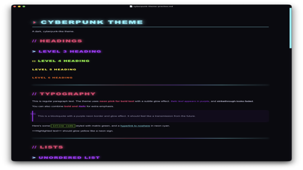

  

<h1 align="center">Cyberpunk</h1>

  <strong>A neon-soaked, glow-heavy dark theme for <a href="https://obsidian.md">Obsidian</a>.</strong> 
  Ported from <a href="https://github.com/channingwalton/typora-themes">channingwalton's Typora Cyberpunk theme</a>.

  
  

---

## Features

- **Neon glow headings** — H1 cyan, H2 pink, H3 purple, H4 green, H5 yellow, H6 orange, each with multi-layer `text-shadow`
- **Heading prefixes** — `▸` `//` `>` `::` decorators in contrasting neon (reading view)
- **H1 flicker animation** — subtle neon sign flicker effect
- **Matrix-green code blocks** — green borders, inset glow, `[ CODE ]` badge
- **Rainbow horizontal rules** — gradient neon line with glow
- **Cyberpunk grid background** — faint cyan grid overlay
- **Animated glitch bar** — pulsing rainbow strip on the right edge
- **Rajdhani font** — clean geometric sans-serif for headings
- **Full Obsidian coverage** — callouts, tables, checkboxes, graph view, nav, command palette, tags
- **Live preview + reading view** — effects work in both modes

## Font

The theme uses [Rajdhani](https://fonts.google.com/specimen/Rajdhani) (loaded from Google Fonts) for a clean geometric look. Falls back to PingFang SC → system sans-serif.

## Installation

### From Obsidian Community Themes

1. Open **Settings → Appearance → Themes → Browse**
2. Search for **Cyberpunk**
3. Click **Install and use**

### Manual

1. Download `theme.css` and `manifest.json`
2. Create folder `{vault}/.obsidian/themes/Cyberpunk/`
3. Place both files inside
4. Settings → Appearance → select **Cyberpunk**

## Color Palette

| Color | Hex | Usage |
|-------|-----|-------|
| Neon Cyan | `#00f5ff` | H1, links, accents, table headers |
| Neon Pink | `#ff006e` | H2, bold, keywords, checkboxes |
| Neon Purple | `#b300ff` | H3, italic, tags, blockquote border |
| Neon Green | `#39ff14` | H4, code blocks, strings, success |
| Neon Yellow | `#ffed00` | H5, function names, highlights |
| Neon Orange | `#ff4500` | H6, warnings |
| Cyber Black | `#0a0a0f` | Background |

## Credits

- Original Typora theme by [Channing Walton](https://github.com/channingwalton/typora-themes)
- Rajdhani font by [Indian Type Foundry](https://fonts.google.com/specimen/Rajdhani)

## License

[MIT](LICENSE)
